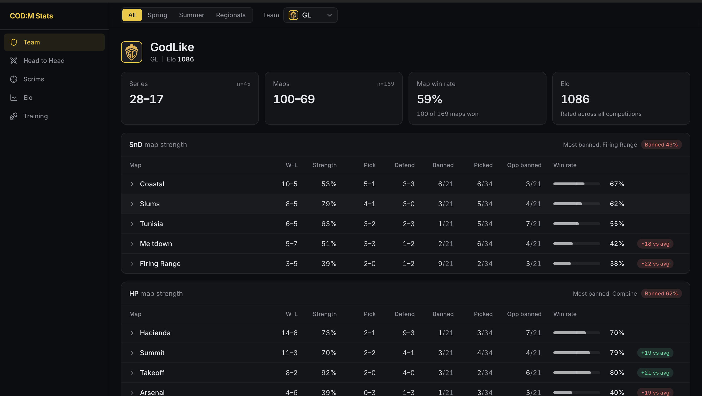
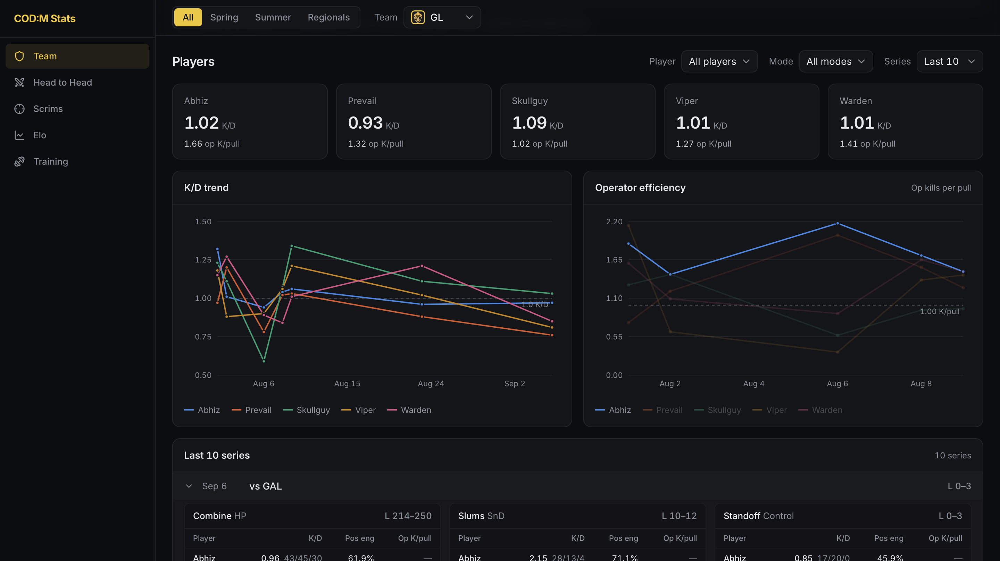
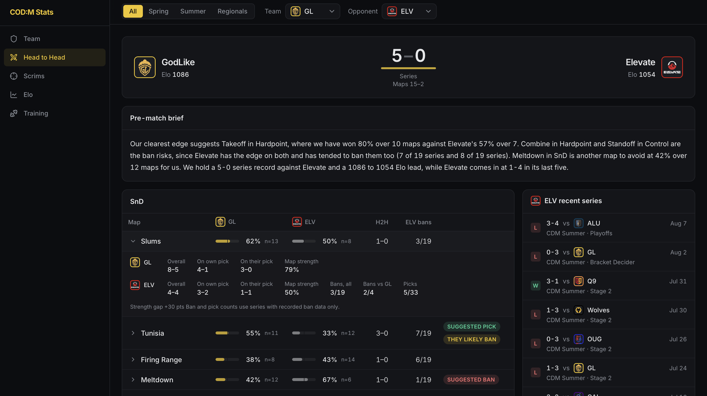
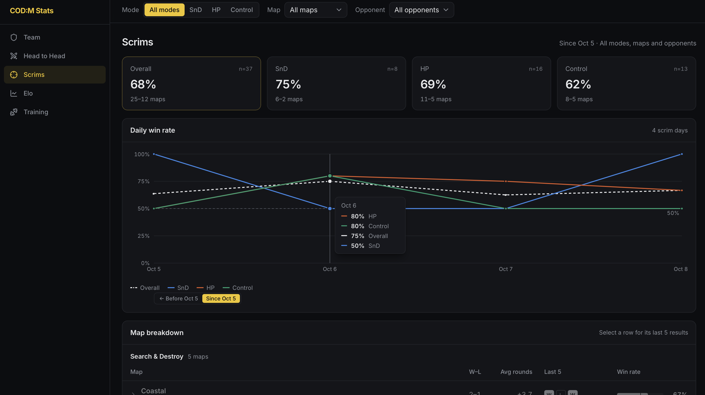
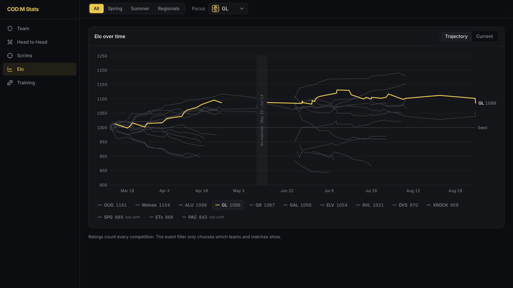
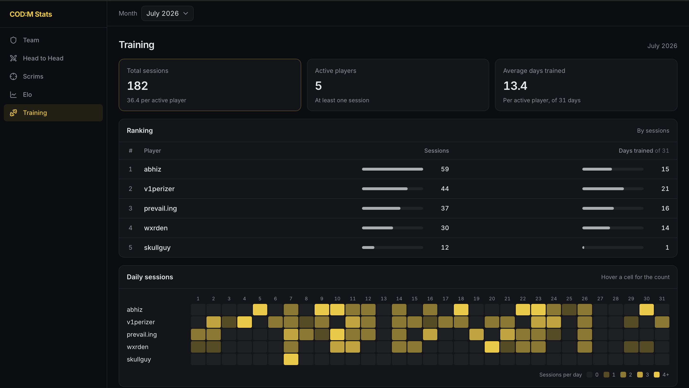

# CDM Stats

Match, scrim and player analytics for GodLike.

Data comes in as CSV and JSON files, goes into a SQLite database (`data/cdl.db`) through a CLI, and is shown in a web dashboard.

## What it tracks

- **League matches:** map results, picks and bans, Elo ratings, and map strength for every team.
- **Scrims:** map results, player K/D/A, and operator stats (op kills per pull) from VOD review.
- **Players:** K/D and operator efficiency over time, in league matches and in scrims.

## Dashboard

A FastAPI backend with a React frontend. It has five pages.

### Team

One team's record, map strength by mode (picks, defends, bans), player K/D and operator trends, and recent series map by map.




### Head to Head

Two teams compared mode by mode, with an optional pre-match brief.



### Scrims

Our scrim win rates (overall and per mode), map breakdown, and player K/D and operator stats. Defaults to the current block of scrims (since Oct 5).



### Elo

Team ratings and how they changed over the season.



### Training

Player participation, read live from the Discord bot.



## Run it locally

Needs Python 3.12 with [uv](https://docs.astral.sh/uv/), and Node 24.

```
uv sync --extra dev
uv run uvicorn cdm_stats.api.app:app --reload   # API on :8000
cd frontend && npm ci && npm run dev            # dashboard on :5173
```

Open http://localhost:5173. Optional features need environment variables (login, H2H brief, Training page); see [.env.example](.env.example).

## Add data

Add rows to the CSV, then ingest it. Re-running a whole file is safe, because rows already in the database are skipped.

```
uv run python main.py ingest-scrims-team data/s2/scrims_team.csv --season 2
uv run python main.py ingest-scrims-players data/s2/scrims_players.csv --season 2
uv run python main.py ingest-scrim-ops data/op_data/<export>.json --season 2
```

[docs/cli-reference.md](docs/cli-reference.md) lists every command and the columns each file needs.

## Deploy

Production is built from the [Dockerfile](Dockerfile) (currently on Railway). The image includes `data/cdl.db`, so new data goes live only after you commit the database and redeploy:

1. Ingest the new data locally and check it in the dashboard.
2. Commit `data/cdl.db` together with the source files, and push.
3. Redeploy (Railway rebuilds on push when the service is connected to the repo).

Set `DASHBOARD_PASSWORD` on the host. Without it, the dashboard has no login and anyone with the URL can use the H2H brief, which spends your Anthropic credits.

## Tests

```
uv run pytest           # backend
cd frontend && npm test # frontend helpers
```

After you change `src/cdm_stats/api/schemas.py`, run `npm run gen:types` in `frontend/` and commit the regenerated `src/api/types.ts`.
